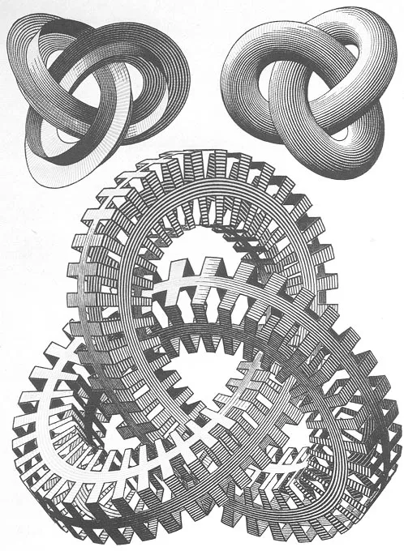

:revealjsdir: https://cdn.jsdelivr.net/npm/reveal.js@5
:revealjs_theme: league

:stem: latexmath
:revealjs_plugins: math
:revealjs_mathjax: https://cdn.jsdelivr.net/npm/mathjax@3/es5/tex-mml-chtml.js

// Presentation theme to use
// Themes provided: beige, black, black-contrast, blood, dracula, league, moon, night, serif, simple, sky, solarized, white, white-contrast
:revealjs_theme: league

// For custom themes, provide path to CSS file relative to the document:
// :revealjs_customTheme: custom.css

:revealjs_slideNumber: true
:revealjs_overview: true
:revealjs_history: false
:revealjs_center: false

// Navigation: 'default', 'linear', or 'grid'
// :revealjs_navigationMode: default

// Auto-advance slides (milliseconds, 0 = disabled)
// :revealjs_autoSlide: 0
// :revealjs_autoSlideStoppable: true

// Parallax background (set image URL to enable)
:revealjs_parallaxBackgroundImage: media/parallax_bg.svg
:revealjs_parallaxBackgroundSize: 200% 200%
:revealjs_parallaxBackgroundHorizontal: 150
:revealjs_parallaxBackgroundVertical: 100

// Syntax highlighting theme for code blocks
:highlightjs-theme: lightfair

// Presentation title
= AsciiDoc ^ion
// Authors, or maybe a subtitle
A Demonstration

// And here we go...

== Basic commands

* Do you see the arrows at the bottom right corner?
* You can use them to navigate the slides. Or use your keyboard arrows.
* Or *Space* to go forward, and *Shift+Space* to go back.

* There are much more special keys for you to try:
** *ESC* to get a slide overview
** *F* to toggle fullscreen mode
** *?* to see all the available commands. There are much more!

== Images

[source, asciidoc]
--

--

results in:

=== Background Images

[source, asciidoc]
--
image::media/background.jpg[background, size=cover]
--

results in:

image::media/background.jpg[background, size=cover]

=== Background GIFs

[source, asciidoc]
--
image::media/surprise.gif[background, size=cover]
--

results in:

image::media/surprise.gif[background, size=cover]

[background-video="https://videos.pexels.com/video-files/856787/856787-sd_640_360_30fps.mp4",options="loop,muted"]
=== Background Videos

[source, asciidoc]
--
[background-video="https://url.org/video.mp4",options="loop,muted"]
--

== PlantUML
[source, asciidoc]
--
[plantuml]
....
database Git
actor Alice
Git -> Alice: Pull
Alice -> Alice: Work
Alice -[#red]> Git  : Push
....
--

results in:

[plantuml]
....
hide footbox
actor Alice
database Git
Git -> Alice: Pull
Alice -> Alice: Work
Alice -[#red]> Git  : Push
....

=== Graphviz

[source, asciidoc]
--
....
[graphviz]
digraph foo {
  rankdir=LR;
  node [style=rounded]
  node1 [shape=box]
  node2 [fillcolor=yellow, style="rounded,filled", shape=diamond]
  node3 [shape=record, label="{ a | b | c }"]
  node1 -> node2 -> node3
}
....
--

results in:

[graphviz]
....
digraph foo {
  rankdir=LR;
  node [style=rounded]
  node1 [shape=box]
  node2 [fillcolor=yellow, style="rounded,filled", shape=diamond]
  node3 [shape=record, label="{ a | b | c }"]

  node1 -> node2 -> node3
}
....

=== Mermaid

Sample Git Flow diagram done by link:https://mermaid.js.org/[Mermaid.Js]

[source, asciidoc]
--
[mermaid]
%%{init: { 'theme': 'neutral', 'gitGraph': {'rotateCommitLabel': false}} }%%
   gitGraph
       commit id:"1"
--

results in:

[mermaid]
....
%%{init: { 'logLevel': 'debug', 'theme': 'neutral', 'gitGraph': {'rotateCommitLabel': false}} }%%
   gitGraph
       commit id:"1"
       commit id:"2"
       commit id:"3"
       branch feature
       commit id:"4"
       commit id:"5"
       checkout main
       commit id:"6"
       commit id:"7"
       cherry-pick id:"4"
....

[.columns]
== Column layout

[.column]
--
* **Edgar Allen Poe**
* Sheri S. Tepper
* Bill Bryson
--

[.column]
--
Edgar Allan Poe (/poʊ/; born Edgar Poe; January 19, 1809 – October 7, 1849) was an American writer, editor, and literary critic.
--

[.columns]
=== Columns with size
[.column.is-one-third]
--
* **Kotlin**
* Java
* Scala
--

[.column]
--
Programming language for Android, mobile cross-platform
and web development, server-side, native,
and data science. Open source forever Github.
--

== Lists

[source, asciidoc]
--
* I'm
* a
* List
--

results in:

* I'm
* a
* List

=== Lists

[source, asciidoc]
--
. Step 1
. Step 2
.. Step 2a
.. Step 2b
. Step 3
--

results in:

. Step 1
. Step 2
.. Step 2a
.. Step 2b
. Step 3

=== Lists with steps

* Press any key

[.step]
* And again
* And once more

=== Descriptions

[source, asciidoc]
--
first term:: definition of first term
second term:: definition of second term
--

results in:

first term:: definition of first term
second term:: definition of second term

== Source Code

[source, asciidoc]
--
[source, clojure]
----
(def lazy-fib
  (concat
   [0 1]
   ((fn fibonacci [a b]
        (lazy-cons (+ a b) (fibonacci b (+ a b)))) 0 1)))
----
--

results in:

[source, clojure]
----
(def lazy-fib
  (concat
   [0 1]
   ((fn fibonacci [a b]
        (lazy-cons (+ a b) (fibonacci b (+ a b)))) 0 1)))
----

== Some other features

Classics: * *bold* *, _ _italic_ _, ` `monospace` `.

^Superscript^ and ~ ~Subscript~ ~.

[.small]
Use `[.small]` to make text smaller.

* Plus (`+`) can +
be used +
to make linebreaks. +
But this is still one paragraph!

== Links

* https://google.com[] or link:https://google.com[Google.com]

* <<Quotes>> — link to another slide by title. Well, looks not great.

* But there is a workaround: <<Quotes, Quotes>>.

== Tables

[source, asciidoc]
--
[%header, cols=2*]
|===
|Character
|Seen in

|Donald Duck
|Mickey Mouse
|===
--

results in:

[%header, cols=2*]
|===
|Character
|Seen in

|Donald Duck
|Mickey Mouse
|===

== Quotes

[quote, Albert Einstein]
A person who never made a mistake never tried anything new.

== Math formulas

link:https://www.mathjax.org/[MathJax] formulas are also supported.
[source, asciidoc]
--
$ J(\theta_0,\theta_1) = \sum_{i=0} $

\( x = {-b \pm \sqrt{b^2-4ac} \over 2a} \)
--
results in:

// \( x = {-b \pm \sqrt{b^2-4ac} \over 2a} \)

stem:[J(\theta_0,\theta_1)=\sum_{i=0}^{m}]
[stem]
++++
x=\frac{-b\pm\sqrt{b^2-4ac}}{2a}
++++

== Speakers View

Press *`'S'`* to show speakers view in separate window.
There is extra info visible in that window!

[.notes]
--
* And here are speakers notes visible just here
* Any block marked as `[.notes]` will appear here
--

== QR codes

++++

https://google.com/

++++

== Animate SVG

[.notes]
--
See link:https://github.com/rajgoel/reveal.js-plugins/tree/master/animate[rajgoel/reveal.js-plugins] for more details and demos.
--

++++

<!--
{ "setup": [
{ "element": "#Price", "modifier": "attr", "parameters": [ {"class": "fragment", "data-fragment-index": "0"} ] },
{ "element": "#Host1", "modifier": "attr", "parameters": [ {"class": "fragment", "data-fragment-index": "1"} ] },
{ "element": "#Choice11", "modifier": "attr", "parameters": [ {"class": "fragment", "data-fragment-index": "2"} ] },
{ "element": "#Choice12", "modifier": "attr", "parameters": [ {"class": "fragment", "data-fragment-index": "3"} ] },
{ "element": "#Host2", "modifier": "attr", "parameters": [ {"class": "fragment", "data-fragment-index": "4"} ] },
{ "element": "#Choice2", "modifier": "attr", "parameters": [ {"class": "fragment", "data-fragment-index": "5"} ] },
{ "element": "#Host3", "modifier": "attr", "parameters": [ {"class": "fragment", "data-fragment-index": "6"} ] },
{ "element": "#Choice3", "modifier": "attr", "parameters": [ {"class": "fragment", "data-fragment-index": "7"} ] }
]}
-->

++++

== Something is missing?

* link:https://github.com/bzzzil/vscode-asciidoc-presentation/issues[Write an issue]
* Propose a pull request 😉

== Reveal.js Parameters

Many reveal.js parameters can be set as document attributes to change the behavior of the slideshow.

[source, asciidoc]
--
// Navigation mode: 'default', 'linear', 'grid'
:revealjs_navigationMode: linear

// Loop the presentation
:revealjs_loop: true

// Enable mouse wheel navigation
:revealjs_mouseWheel: true

// Auto-advance slides every 3 seconds
:revealjs_autoSlide: 3000
:revealjs_autoSlideStoppable: true

// Parallax background
:revealjs_parallaxBackgroundImage: https://example.com/bg.jpg
:revealjs_parallaxBackgroundSize: 2100px 1200px
:revealjs_parallaxBackgroundHorizontal: 200
:revealjs_parallaxBackgroundVertical: 50
--

== Cheers!
